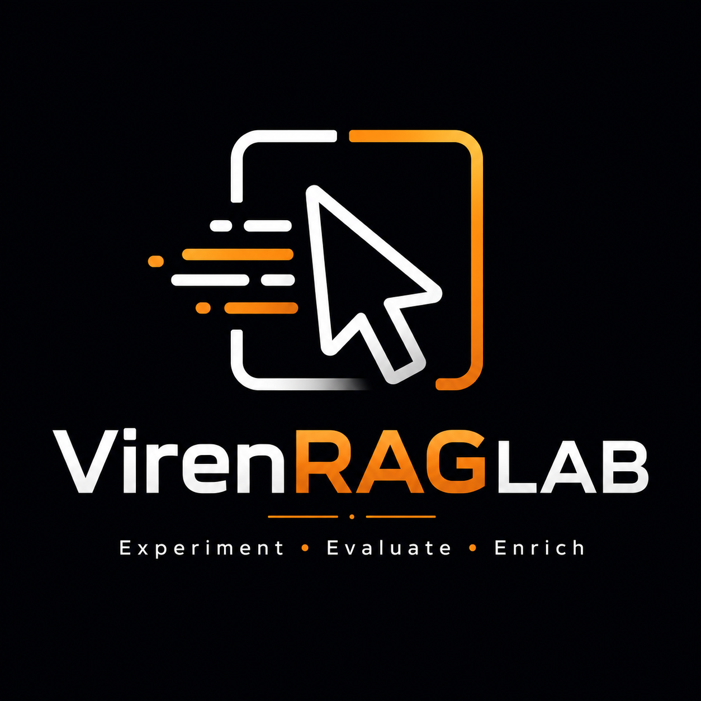
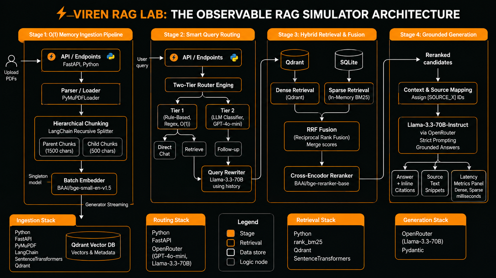
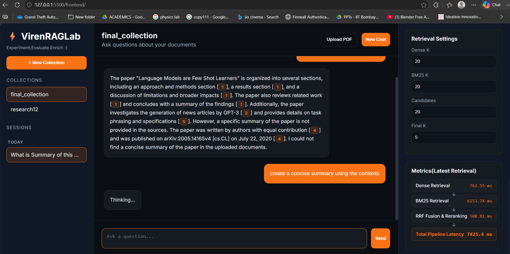
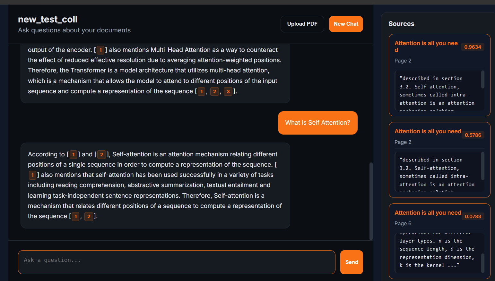
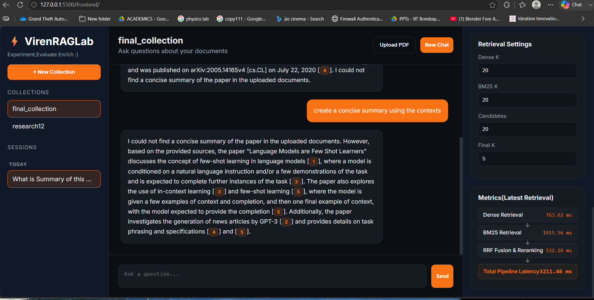

# ⚡ VirenRAGLab — The Observable Hybrid RAG Simulator

<div align="center">



### Experiment • Evaluate • Enrich

**An end-to-end Hybrid RAG platform for document intelligence, retrieval experimentation, and observability.**

[Features](#-features) •
[Architecture](#-architecture) •
[Tech Stack](#-tech-stack) •
[Quick Start](#-quick-start) •
[Roadmap](#-roadmap)

</div>

---

## Overview

VirenRAGLab is a production-inspired Retrieval-Augmented Generation (RAG) platform designed with two goals:

### For End Users

* Chat with large PDF collections using grounded answers.
* Every response is backed by source citations.
* Collection-based document management.
* Fast retrieval over thousands of chunks.

### For AI Engineers

* Compare Dense, Sparse, and Hybrid Retrieval pipelines.
* Observe routing decisions and retrieval latency.
* Experiment with chunking, reranking, and fusion strategies.
* Understand how retrieval quality impacts generation quality.

---

## Key Features

### Intelligent Query Routing

* Two-tier routing architecture.
* Rule-based O(1) router for greetings and simple intents.
* LLM-based classifier for complex retrieval decisions.
* Query rewriting for follow-up conversations.

### Hybrid Retrieval Pipeline

* Dense Retrieval using Qdrant Vector Search.
* Sparse Retrieval using BM25.
* Reciprocal Rank Fusion (RRF).
* Cross-Encoder reranking for precision.

### Observable RAG System

* Dense retrieval latency tracking.
* Sparse retrieval latency tracking.
* Fusion and reranking metrics.
* End-to-end pipeline observability.

### Scalable Ingestion

* Streaming PDF ingestion.
* Hierarchical Parent-Child chunking.
* Metadata-aware storage.
* Optimized memory usage for large corpora.

---

## Architecture



### Demo Pics





### Retrieval Flow

PDF Upload
↓
Parsing & Chunking
↓
Embedding Generation
↓
Qdrant Vector Storage
↓
Query Routing
↓
Dense + Sparse Retrieval
↓
RRF Fusion
↓
Cross-Encoder Reranking
↓
Grounded LLM Generation
↓
Answer + Citations + Metrics

---

## Tech Stack

| Layer        | Technologies                        |
| ------------ | ----------------------------------- |
| Frontend     | HTML, CSS, JavaScript               |
| Backend      | FastAPI, Python                     |
| Database     | SQLite                              |
| Vector Store | Qdrant                              |
| Parsing      | PyMuPDF                             |
| Chunking     | LangChain Recursive Splitter        |
| Embeddings   | BAAI/bge-small-en-v1.5              |
| Reranker     | BAAI/bge-reranker-base              |
| Retrieval    | BM25 + Dense Search                 |
| LLM          | Llama 3.3 70B Instruct (OpenRouter) |

---

## Project Structure

```text
virenraglab/
│
├── assets/
├── frontend/
├── user_uploads/
├── local_qdrant_db/
│
├── app.py
├── upload.py
├── ingest.py
├── embed.py
├── retrieve.py
├── retrieve_bm25.py
├── retrieve_reranked_hybrid.py
├── reranker.py
├── router.py
├── generate.py
├── database.py
│
├── requirements.txt
└── .env
```

---

## Quick Start

### Clone Repository

```bash
git clone https://github.com/<username>/virenraglab.git

cd virenraglab
```

### Create Virtual Environment

```bash
python -m venv .venv

source .venv/bin/activate
```

Windows:

```bash
.venv\Scripts\activate
```

### Install Dependencies

```bash
pip install -r requirements.txt
```

### Configure Environment Variables

```env
OPEN_ROUTER_KEY=your_key

QDRANT_URL=your_qdrant_url

QDRANT_API_KEY=your_qdrant_api_key
```

### Run Backend

```bash
uvicorn app:app --reload
```

### Launch Frontend

Open:

```text
frontend/index.html
```

Upload PDFs, create a collection, and start experimenting.

---

## Performance Highlights
### RAG Evaluation

| Metric              | Score  |
| ------------------- | ------ |
| Retrieval Recall@10 | 91.78% |
| Answer Similarity   | 84.52% |
| Faithfulness        | 82.93% |
| Context Precision   | 53.88% |

---

## Future Roadmap

### Phase 1 — Retrieval Playground

* Configurable chunk sizes and overlap.
* Multiple chunking strategies.
* Cache controls and benchmarking.

### Phase 2 — Model Agnostic RAG

* Ollama integration.
* OpenAI integration.
* Embedding model comparison.
* A/B retrieval testing.

### Phase 3 — Automated Evaluation

* RAGAS integration.
* Cost-per-query tracking.
* Hallucination detection.
* Retrieval analytics dashboard.

---

## Why This Project?

Most RAG systems operate as black boxes.

VirenRAGLab exposes the entire retrieval pipeline, allowing developers to understand, benchmark, and improve retrieval quality while delivering grounded document-based answers.

Built to explore the question:

> "What actually happens inside a production-grade RAG system?"
